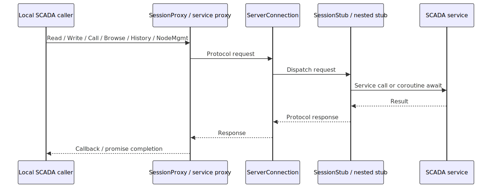
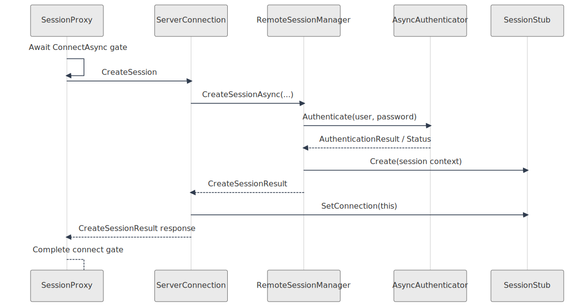
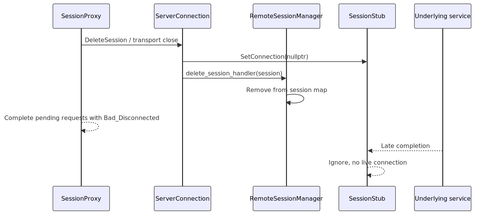

# Core Remote Design

This document describes the shared `core/remote/` subsystem that implements
the SCADA remote protocol on both the server and client sides.

Related documents:

- [README.md](./README.md) for the core docs index
- [services.md](./services.md) for the SCADA service interfaces and coroutine
  adapters used by the remote layer
- [../../server/docs/remote_module.md](../../server/docs/remote_module.md) for
  the server-side module wiring that hosts `core/remote`
- [../../server/docs/coroutine_migration_plan.md](../../server/docs/coroutine_migration_plan.md)
  for the staged migration of the remote/session path to coroutine-first
  internals

## Diagrams

### Overview

Source: [remote_overview.mmd](./remote_overview.mmd)

### Request Flow

Source: [remote_request_flow.mmd](./remote_request_flow.mmd)

### Session Creation Sequence

Source: [remote_session_creation.mmd](./remote_session_creation.mmd)

### Disconnect Sequence

Source: [remote_disconnect.mmd](./remote_disconnect.mmd)

## Purpose

`core/remote` provides the protocol implementation behind remote SCADA client
connections.

It owns:

- transport framing and payload read/write helpers
- server-side accepted connections and authenticated session stubs
- client-side session proxy and service proxies
- protocol serialization/deserialization glue

It deliberately does not own server module startup or configuration loading.
Those concerns stay in `server/remote`.

## Main Components

### `RemoteSessionManager`

Files:

- `core/remote/remote_session_manager.h`
- `core/remote/remote_session_manager.cpp`

Responsibilities:

- open listener transports on configured endpoints
- accept incoming transports through `RemoteListener`
- authenticate `CreateSession` requests
- enforce duplicate-session policy
- create and delete logical `SessionStub` instances
- notify observers about session open/close events

This is the server-side lifecycle coordinator for listeners, accepted
connections, and authenticated logical sessions.

### `ServerConnection`

Files:

- `core/remote/remote_connection.h`
- `core/remote/remote_connection.cpp`

Responsibilities:

- own one accepted transport
- run the transport read loop
- process create-session and delete-session requests before session-bound
  traffic
- bind or detach a `SessionStub`
- serialize responses and notifications through the transport write queue

Important invariant:

- when a session is deleted, the session’s connection back-pointer must be
  cleared before higher-level deletion callbacks run, so late completions see a
  null connection instead of a dangling `ServerConnection*`

### `SessionStub`

Files:

- `core/remote/session_stub.h`
- `core/remote/session_stub.cpp`

Responsibilities:

- route authenticated protocol requests to SCADA services
- own per-session subscriptions and monitored-item state
- buffer outbound messages until a live connection is attached
- create the one-time callback-to-coroutine service adapters used by the
  coroutine-first request handlers and nested stubs

Current coroutine boundary:

- `SessionStub` adapts legacy callback services once at session construction
- nested stubs then consume `Coroutine*Service` interfaces directly
- request handlers stay coroutine-first instead of rebuilding local adapters

### Nested Stubs

Files:

- `core/remote/history_stub.*`
- `core/remote/node_management_stub.*`
- `core/remote/view_service_stub.*`
- `core/remote/subscription_stub.*`

Responsibilities:

- parse request-specific protocol payloads
- call the matching service or coroutine-service dependency
- serialize request-specific responses and notifications

`HistoryStub` and `NodeManagementStub` now consume coroutine service
dependencies from `SessionStub` rather than constructing local callback
adapters.

### `SessionProxy`

Files:

- `core/remote/session_proxy.h`
- `core/remote/session_proxy.cpp`

Responsibilities:

- expose the remote connection as local SCADA service interfaces
- open the client transport and issue `CreateSession`
- maintain the read loop, request map, ping loop, and reconnect/disconnect flow
- complete in-flight client requests on disconnect

`SessionProxy` is the client-side mirror of the server-side session path.

### Client Service Proxies

Files:

- `core/remote/view_service_proxy.*`
- `core/remote/node_management_proxy.*`
- `core/remote/history_proxy.*`
- `core/remote/subscription_proxy.*`
- `core/remote/monitored_item_proxy.*`

Responsibilities:

- expose individual SCADA service interfaces on top of `MessageSender`
- serialize client requests into protocol messages
- map protocol responses back to local callbacks

## Runtime Composition

Server side:

1. `server/remote/RemoteModule` constructs `RemoteSessionManager`.
2. `RemoteSessionManager` opens listeners and accepts transports.
3. Each accepted transport becomes a `ServerConnection`.
4. Successful authentication creates a `SessionStub`.
5. `SessionStub` routes subsequent service requests.

Client side:

1. `CreateRemoteServices(...)` creates one `SessionProxy`.
2. `SessionProxy::services()` exposes local SCADA service interfaces.
3. Service proxies serialize requests through the session transport.
4. Incoming responses are dispatched back to pending callbacks.

## Request Flow

### Session Creation

1. Client `SessionProxy` opens a transport.
2. `SessionProxy` sends `CreateSession`.
3. Server `ServerConnection` forwards it to `RemoteSessionManager`.
4. `RemoteSessionManager` authenticates and creates a `SessionStub`.
5. `ServerConnection` binds the new session and returns the create-session
   response.
6. `SessionProxy` marks the session connected and exposes remote services.

### Service Request Routing

1. A local client call enters `SessionProxy` or one of its service proxies.
2. The proxy serializes a protocol request and stores a response handler.
3. `ServerConnection` passes the request to the bound `SessionStub`.
4. `SessionStub` or one of its nested stubs calls the matching service.
5. The result is serialized into a protocol response.
6. `SessionProxy` matches the response back to the stored handler.

### Disconnect And Late Completion Handling

1. Client disconnect, transport close, or remote logoff detaches the session.
2. In-flight client requests are completed with `Bad_Disconnected`.
3. Late server-side completions may still arrive from underlying services.
4. Those completions are ignored because the detached session no longer has a
   live `Connection`.

## Lifecycle And Ownership

- `RemoteSessionManager` owns listeners and accepted `ServerConnection`
  instances.
- `RemoteSessionManager` also owns the map of live `SessionStub`s.
- `ServerConnection` holds only a non-owning pointer to the currently attached
  `SessionStub`.
- `SessionStub` holds only a non-owning pointer to the currently attached
  `Connection`.
- `SessionProxy` owns the client transport, pending request map, ping timer,
  and service proxies.

## Key Invariants

- create-session and delete-session handling must stay serialized on the
  expected executor
- request parsing is synchronous once a protocol payload is available
- transport close must complete pending client requests deterministically
- late callbacks after disconnect must not touch a stale connection
- service adaptation should happen once at the session boundary, not inside
  every request handler
